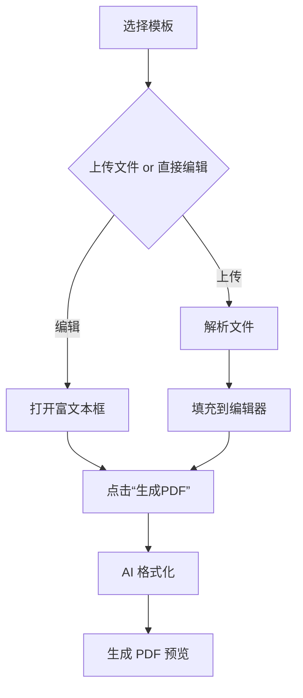
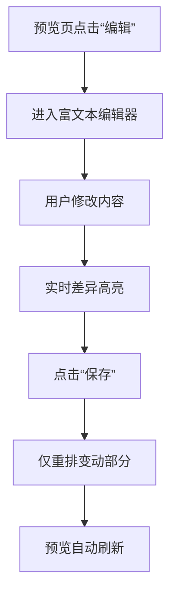
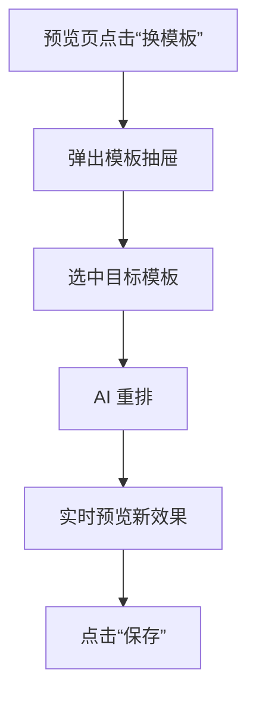

# 子流程 PRD（V1 必须实现）

文档版本：V1.0  
编写日期：2025-09-04  
适用范围：仅聚焦「生成 / 编辑 / 换模板」三大核心子流程

---

## 1. 流程总览

| 编号 | 流程名称 | 是否 V1 必须 | 一句话描述 |
|---|---|---|---|
| P1 | 生成 PDF | ✅ | 选模板→上传/编辑→立即生成→在线预览 |
| P2 | 编辑 PDF | ✅ | 在已生成 PDF 上改字→实时刷新→保存 |
| P3 | 更换模板 | ✅ | 一键换模板→内容自动重排→实时刷新 |
| P4 | 下载 PDF | ✅ | 预览页点击下载，秒级完成 |
| P5 | 分享 PDF | ✅ | 生成短链，可一键复制 |
| P6 | 查看 PDF | ✅ | 通过短链免登录查看 |

> 本文档重点细化 **P1、P2、P3** 的用户故事、验收标准、边界规则、异常处理及接口契约。P4-P6 仅列主要验收点，不做展开。

---

## 2. 流程 1：生成 PDF（P1）

### 2.1 用户故事
作为一名学生，我想在 30 秒内把课程论文草稿变成排版精美的 PDF，以便直接提交。

### 2.2 前置条件
- 用户已登录或处于游客状态（游客配额限制 3 次/日）。  
- 浏览器支持 ES2020、WebAssembly。

### 2.3 主流程（Happy Path）


### 2.4 关键节点验收标准
| 节点 | 验收标准 | 指标 |
|---|---|---|
| 模板选择 | 缩略图加载 ≤500 ms；点击即选中 | 95% 请求 |
| 文件上传 | 支持 .txt/.md/.docx；大小 ≤10 MB；成功率 ≥99% | 错误文案明确 |
| 解析 & 填充 | 解析后自动分段、保留标题层级 | 丢失格式 <1% |
| AI 格式化 | 从点击到首屏预览 ≤5 秒 | 95% 请求 |
| 预览 | 缩放、翻页、滚动不卡顿 | 60 FPS |

### 2.5 异常 & 分支
| 场景 | 前端提示 | 后端行为 |
|---|---|---|
| 文件解析失败 | Toast：“解析失败，请检查文件格式” | 记录日志并返回 422 |
| AI 队列过载 | 显示排队动画 + 预计等待 10 s | 返回 Retry-After 头 |
| 配额不足 | 模态弹窗引导升级 | HTTP 403 + 错误码 `quota_exceeded` |

---

## 3. 流程 2：编辑 PDF（P2）

### 3.1 用户故事
作为一名职场人士，我想在已生成的 PDF 上直接改几个错别字并立刻看到效果，而不用重新上传。

### 3.2 前置条件
- 用户已成功完成 P1 并处于预览页。
- 该 PDF 仍在本人的“最近文档”列表中（保留 30 天）。

### 3.3 主流程


### 3.4 实时编辑规则
| 规则 | 说明 |
|---|---|
| 锁定区域 | 页眉/页脚/页码不可直接编辑，仅通过模板配置 |
| 字数限制 | 单段落 ≤2 k 字，超出弹窗提示拆分 |
| 图片处理 | 支持替换、裁剪、拖拽排序；图片改动即视为新资源 |
| 版本控制 | 每次“保存”生成新版本，保留最近 10 个版本 |

### 3.5 验收标准
- 保存到预览刷新 ≤3 秒（增量渲染）。  
- 撤销/重做栈深度 ≥50 步。  
- 并发：同一文档 3 人同时编辑，冲突合并成功率 ≥98%。

---

## 4. 流程 3：更换模板（P3）

### 4.1 用户故事
作为一名 HR，我想把刚做好的“员工手册”从商务蓝换成极简白模板，一键重排即可。

### 4.2 前置条件
- 同 P2，用户已在预览页。

### 4.3 主流程


### 4.4 自动映射规则
| 原模板元素 | 新模板无对应元素 | 处理方案 |
|---|---|---|
| 一级标题 | 不存在 | 降级为加粗大字号正文 |
| 引用块 | 不存在 | 转换为普通段落 + 左侧边框 |
| 页眉 Logo | 新模板无 Logo 区域 | 静默丢弃（提示一次） |

### 4.5 验收标准
- 模板切换到首屏预览 ≤4 秒。  
- 内容不丢失；格式偏差 ≤1 mm（A4 标尺）。  
- 支持“撤销换模板”（一键回退到上一模板 + 内容）。

---

## 5. 公共交互与界面规范

| 元素 | 规范 |
|---|---|
| 加载动画 | Lottie JSON，循环 ≤3 秒自动换文字提示 |
| 错误提示 | Toast 3 秒自动消失；可点击“查看详情”展开 |
| 按钮文案 | “生成 PDF” / “保存并刷新” / “下载” |
| 快捷键 | Ctrl+S 保存；Ctrl+Z 撤销；Ctrl+Y 重做 |

---

## 6. 接口契约（核心字段）

### 6.1 生成 PDF
```
POST /api/v1/generate
{
  "template_id": "tpl_resume_2025",
  "source": { "type": "text", "content": "..." } // or { "type": "file", "file_id": "f123" }
}
→ 201 { "doc_id": "d456", "status": "processing" }

GET /api/v1/documents/{doc_id}
→ 200 { "status": "done", "preview_url": "https://cdn.xxx.com/..." }
```

### 6.2 保存编辑
```
PATCH /api/v1/documents/{doc_id}/content
{
  "delta": { "ops": [...] } // Quill Delta
}
→ 200 { "version": 7, "preview_url": "..." }
```

### 6.3 更换模板
```
PUT /api/v1/documents/{doc_id}/template
{ "new_template_id": "tpl_minimal_white" }
→ 200 { "preview_url": "..." }
```

---

## 7. 性能与异常指标

| 指标 | 阈值 | 监控方式 |
|---|---|---|
| 生成 PDF 95th 延迟 | ≤5 s | Prometheus + Grafana |
| 编辑保存 95th 延迟 | ≤3 s | 同上 |
| 换模板 95th 延迟 | ≤4 s | 同上 |
| 可用性 | ≥99.9%/月 | Pingdom |
| 前端 JS 错误率 | ≤0.3% | Sentry |

---

## 8. 核心架构理念

1.  **前端驱动:** 利用 Next.js 全栈能力，逻辑优先放前端及 Edge/API Routes。
2.  **服务集成:** 依赖第三方服务处理后端复杂性 (Supabase, Replicate, Square)。
3.  **服务端逻辑最小化:** 仅在必要时使用 API Routes/Edge Functions (安全 API 调用代理, Webhook 处理)。
4.  **SEO 优先:** 利用 Next.js SSR/SSG, Metadata API, 多语言路由。
5.  **高内聚低耦合:** 组件化、模块化、服务分离。
6.  **原生多语言:** 采用 Next.js 基于路径的 i18n 路由。

## 9. 技术选型

1.   **框架:** Next.js 14+ (App Router)
2.   **语言:** JavaScript
3.   **样式:** Tailwind CSS
4.   **认证:** Supabase Auth (Google Provider)
5.   **数据库:** Supabase Database
6.   **AI 服务:** Replicate
7.   **支付:** Square
8.   **状态管理:** React Context / Zustand / Jotai (按需)
9.   **i18n:** Next.js Native i18n Routing
10.   **博客 (MVP):** 本地 Markdown 文件 + Git (`gray-matter`, `remark`)
11.  **富文本编辑器:** 集成 tinymce 来编辑


## 10. 项目文件结构

```plaintext
.
├── app/                          # Next.js App Router 核心目录
│   ├── [lang]/                   # 动态语言路由段 (e.g., /en, /zh)
│   │   ├── page.tsx              # 网站首页 (核心功能 + SEO 内容)
│   │   ├── layout.tsx            # 语言根布局 (Navbar, Footer, 共享状态, i18n字典)
│   │   ├── pricing/
│   │   │   └── page.tsx          # 定价页面
│   │   ├── blog/
│   │   │   ├── page.tsx          # 博客列表页面
│   │   │   └── [slug]/
│   │   │       └── page.tsx      # 单篇博客文章页面
│   │   └── account/
│   │       └── page.tsx          # 用户账户/仪表盘页面
│   │
│   ├── api/                      # API 路由
│   │   ├── replicate/            # (可选但推荐) 代理 Replicate API 调用
│   │   │   └── route.ts
│   │   ├── square-webhook/       # 处理 Square Webhook
│   │   │   └── route.ts
│   │   └── auth/                 # 可能的认证回调处理 (若 Supabase 需要)
│   │       └── callback/         # (示例)
│   │           └── route.ts
│   │
│   └── globals.css               # 全局 CSS
│   └── layout.tsx                # 根布局 (<html>, <body>)
│
├── components/                   # 可复用 UI 组件
│   ├── ui/                       # 基础 UI (Button, Input, Card, Modal, etc.)
│   ├── layout/                   # 布局组件 (Navbar, Footer)
│   ├── auth/                     # 认证 (LoginButton, UserProfile)
│   ├── billing/                  # 支付订阅 (PricingCard, ManageSubscriptionButton)
│   ├── core/                     # 核心功能
│   ├── blog/                     # 博客 (PostCard, PostContent)
│   └── common/                   # 通用 (LoadingSpinner, LanguageSwitcher)
│
├── lib/                          # 辅助函数、服务集成、核心逻辑
│   ├── supabase.ts               # Supabase 客户端初始化和辅助函数
│   ├── replicate.ts              # Replicate API 调用逻辑
│   ├── square.ts                 # Square API 调用逻辑
│   ├── blog.ts                   # 获取博客文章列表和内容的逻辑 (Markdown)
│   ├── i18n.ts                   # i18n 字典加载和辅助函数
│   └── utils.ts                  # 通用工具函数
│
├── dictionaries/                 # i18n 语言文件
│   ├── en.json
│   └── zh.json
│
├── content/                      # Markdown 博客内容
│   └── blog/
│       ├── en/
│       │   ├── first-post.md
│       │   └── another-post.mdx
│       └── zh/
│           ├── first-post.md
│           └── another-post.mdx
│
├── public/                       # 静态资源
│   ├── images/
│   └── robots.txt
│
├── middleware.ts                 # Next.js 中间件 (i18n 路由处理)
├── next.config.mjs               # Next.js 配置 (i18n 等)
├── tailwind.config.js            # Tailwind CSS 配置
├── postcss.config.js             # PostCSS 配置
├── jsconfig.json                 # JavaScript 项目配置 (或 tsconfig.json)
├── package.json
├── .env.local                    # 环境变量 (API Keys - **不提交到 Git**)
└── .gitignore
```